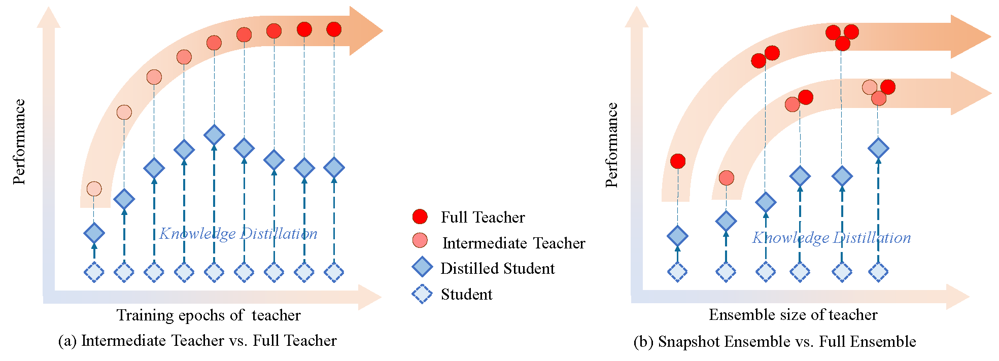

# Don’t Throw Your Model Checkpoints Away
This repo contains the official **PyTorch** code for CheckpointKD [[paper]](to do: add paper link). 

(**This repo is under construction**)


## Introduction

---


We make an intriguing observation that an intermediate model, i.e., a checkpoint in the middle of the training procedure, often serves as a better teacher compared to the fully converged model, although the former has much lower accuracy. More surprisingly, a weak snapshot ensemble of several intermediate models from a same training trajectory can outperform a strong ensemble of independently trained and fully converged models, when they are used as teachers. 


## Usage

---

### Requirements

```
pip install -r requirements.txt
```

### Experiments
The classical seetings of teacher-student knowledge distillation are followed. 

To pretrain the teacher model and save checkpoints every 20 epochs:
```
python main.py --data cifar100 --train_teacher --baseline --save_epoch_teacher --epo 20 --data_root ${data_root} --save ${log_root} --arch ${teacher_arch} 
```
`${teacher_arch}`: `wrn_40_2`, `resnet110`

To distill the student model:
```
python main.py --data cifar100  --train_student  --desemble_epoch  --arch ${student_arch} --teacher_arch ${teaher_arch} --teacher_num ${teacher_num} --T ${temperature} --alpha ${alpha}  --teacher_path ${path_to_load_pretrained_teacher_model} --data_root ${data_root} --save ${log_root} 
```
`${student_arch}`: `wrn_40_1`, `resnet32`, `mobilenetv2_075`

`${teacher_num}`: 

`1` (for "Full Teacher vs. Intermediate Teacher")

`2` (for "Full Ensemble vs. Snapshot Ensemble")

## Contact

---

If you have any question, please feel free to contact the authors. Chaofei Wang: [wangcf18@mails.tsinghua.edu.cn](mailto:wangcf18@mails.tsinghua.edu.cn), Qisen Yang: [yangqs19@mails.tsinghua.edu.cn](mailto:wangcf18@mails.tsinghua.edu.cn).

## Citation

---

If you find our work is useful in your research, please consider citing:

```bibtex
@misc{to do
}
```
